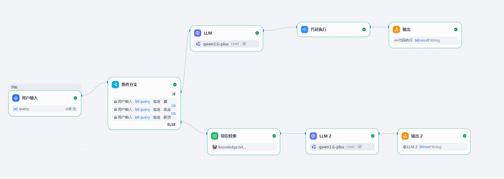

```markdown
# Corporate Investment Research & Multi-Branch Regulatory Review Agent System
## 企业级多源数据智能投研与多分支合规审查 Agent 系统

[](https://dify.ai/)
[](https://www.python.org/)
[]()

本系统是一套基于 **Dify Workflow** 编排的高可用、低幻觉企业级智能投研与自动化合规审查 Agent。系统突破了传统单链 Chatbot 的局限，采用多分支有向无环图（DAG）架构，完美融合了 **向量检索（RAG）**、**结构化参数提取（LLM Router）** 与 **轻量级代码沙箱（Python Code Sandbox）**，旨在解决大模型在复杂数学计算及私有垂直知识检索场景下的工业落地痛点。

---

## 📸 系统运行拓扑与全链路运行截图




---

## 🛠️ 核心技术栈 (Tech Stack)

*   **工作流编排引擎 (Workflow Engine)**：**Dify Workflow** 生产级流水线控制，摆脱传统单链对话限制。
*   **大模型意图路由 (LLM Router & Extractor)**：大模型原生调用 + 强约束提示词工程（Structured Output），实现高可靠参数提取。
*   **自动化控制流 (Conditional Branching)**：基于条件路由（Conditional Router）的多分支动态智能分流。
*   **私有数据增强 (Advanced RAG)**：高质量层次化分片技术（Chunking） + 向量垂直知识库检索。
*   **工程执行计算器 (Python Code Sandbox)**：基于原生 `json` 序列化与反序列化的高精度物理计算沙箱。

---

## 🧠 核心架构与业务控制流

系统在接收到非结构化的人类自然语言输入后，严格遵循以下两条工程路径进行闭环处理：


```

```


                                       ➡️ [分支 A：合规/投研检索] ➡️ 高质量向量知识检索 ➡️ 大模型上下文重组 ➡️ 
[用户 Query 输入] ➡️ 条件路由                                                                                           ➡️ [输出 (End)]
                                       ➡️ [分支 B：高精财务计算] ➡️ LLM 参数提取器(JSON) ➡️ Python沙箱物理计算 ➡️ 

```

### 1. 分支 A：垂直领域高质量 RAG
*   **应用场景**：针对“张三、李四、王五等人的情况”等非结构化私有数据查询。
*   **工程落地**：上游条件分支拦截普通文本询问 ➡️ 触发知识检索节点 ➡️ 基于词频与向量进行语义召回 ➡️ 将 Context 动态解析并注入下游 LLM Prompt ➡️ 最终输出零幻觉的合规结果。

### 2. 分支 B：代码级杜绝数学幻觉
*   **应用场景**：针对“月薪 18000、绩效分 4.5 自动核算年终奖”等高精度数值计算需求。
*   **工程落地**：
    1.  **大模型参数提取**：利用强约束的 `System Prompt` 强行阻断大模型解释性废话，将自然语言 100% 稳定转化为纯净的 `JSON` 字符串。
    2.  **Python 沙箱接管**：代码节点通过 `text` 变量承接大模型输出，利用底层 `json.loads` 解析转义字符并打散为 Python 字典（Dict）。
    3.  **精确数值归档**：使用纯 Python 物理代码取代大模型的心算，从根本上解决大模型的数学幻觉，实现 100% 准确的财务核算。

---

## 💻 核心物理节点源码 (Code Sandbox Node)

以下为集成在 Dify 系统中、负责衔接上游结构化大模型输出并进行业务逻辑计算的 Python 核心节点源码。本节点在输入端已完成与大模型原生输出变量（`text`）的无缝卡槽绑定。

```python
import json

def main(text: str) -> dict:
    """
    Dify 生产流代码执行节点：承接上游 LLM 提取的 text 参数进行高精度计算
    """
    try:
        # 直接反序列化大模型吐出来的纯净 JSON 字符串，消解转义字符 \"
        data = json.loads(text)
        
        # 安全读取键值对
        salary = int(data.get("salary", 0))
        score = float(data.get("score", 0))
        
        # 执行物理数值计算，彻底杜绝大模型数值幻觉
        bonus = salary * score * 0.1
        
        return {
            "result": f"【Dify 自动化脚本计算成功】：应发年终奖为 {round(bonus, 2)} 元。"
        }
    except Exception as e:
        return {
            "result": f"【计算节点解析失败】：原因为 {str(e)}"
        }

```

---

## 🚀 快速部署与复现

1. 注册并登录 [Dify.ai](https://dify.ai/) 平台。
2. 在 Dify 主页点击“创建空白应用”，选择“工作流（Workflow）”模式。
3. 在大模型供应商后台配置好对应的大模型 API Key（如通义千问、豆包等）。
4. 在知识库板块新建私有合规知识库，并以“高质量”模式完成向量化索引。
5. 按照本仓库提供的拓扑架构连接核心节点，并将大模型输出与 Python 节点的 `text` 参数进行绑定。
6. 点击右上角“试运行”，即可完成全链路生产流复现。

```

```
